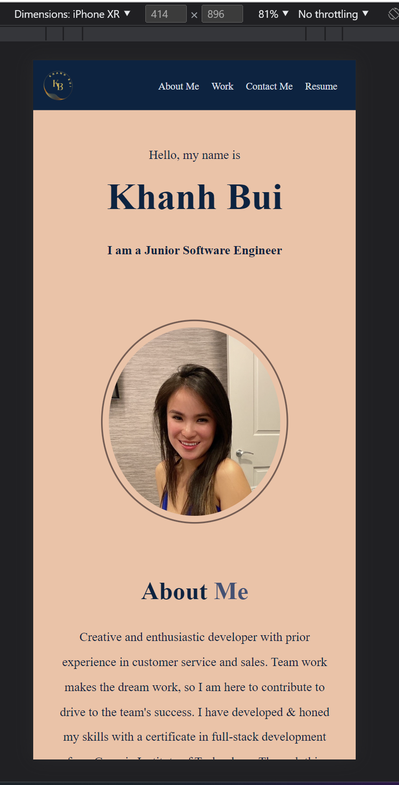
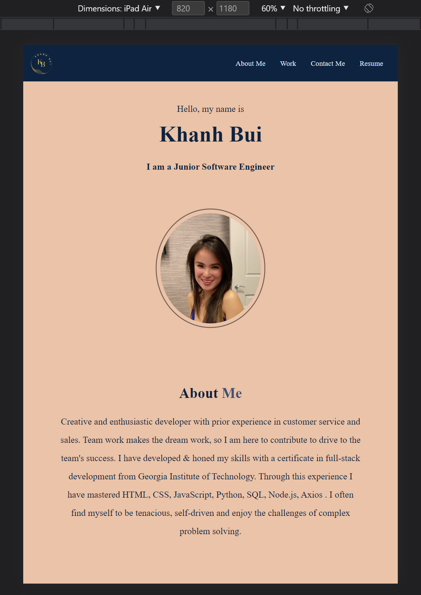
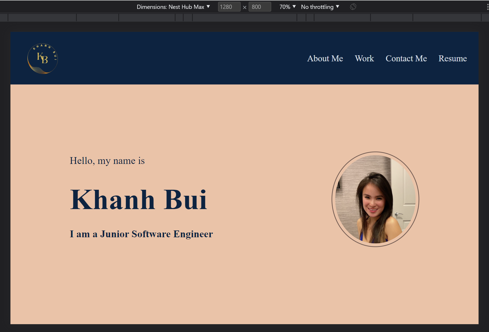

# My Portfolio

## Table of Contents:
---

- [Description](#description)
- [Installation](#installation)
- [Usage](#usage)
- [Screenshot](#screenshot)
- [Link](#link)
- [Contact](#contact)

## Description:
---
The purpose of this project is to showcase my skills and abilities to potential employers. Specifically, it demonstrates my proficiency in utilizing flexbox, media queries, and CSS variables, which are recent additions to my skill set. Furthermore, the project was developed using a mobile-first design approach and is fully responsive.

## Installation:
---
N/A

## Usage
---
The website comprises four main sections, namely About Me, Work, Contact Me, and Resume, which can be easily accessed by selecting the corresponding options in the navigation bar. The layout is designed to be responsive, ensuring compatibility across a range of browsers and devices. In addition, there are multiple ways to get in touch via the shortcut icons, and a hyperlink is provided for viewing the resume.

## Screenshot
---

 

 

## Link
---
N/A

## Contact
---
If there are any questions or concerns, please contact me at: 
[GitHub](https://github.com/khanhpbui) 
[Email](mailto:pkkhanhbui@gmail.com)